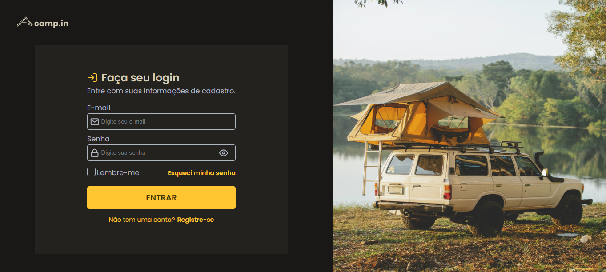

  

  <a href="#-tecnologias">Tecnologias</a>&nbsp;&nbsp;&nbsp;|&nbsp;&nbsp;&nbsp;
  <a href="#-projeto">Projeto</a>&nbsp;&nbsp;&nbsp;

## 🚀 Tecnologias

- HTML
- CSS
- JavaScript

## 🚧 Projeto

Live Preview: https://joaosam.github.io/loginform/

## 🎨 Layout:

Figma: https://www.figma.com/file/AzwDZNbnpmWvz2m9dPvOD8/DD-%2F-Login-Form---CSS-(Copy)?node-id=216%3A2

